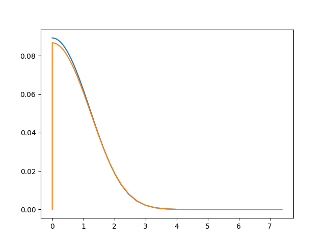

# AtomEnergyLevels

[](https://travis-ci.com/malykhin-sergei/AtomEnergyLevels.jl)
[](https://coveralls.io/github/malykhin-sergei/AtomEnergyLevels.jl?branch=master)

Solve numerically

 1. 1D [Schrödinger equation](https://en.wikipedia.org/wiki/Schr%C3%B6dinger_equation) by the [spectral collocation (i.e., pseudospectral) method](https://en.wikipedia.org/wiki/Collocation_method)
 2. Schrödinger equation for the [particle in a spherically symmetric potential](https://en.wikipedia.org/wiki/Particle_in_a_spherically_symmetric_potential)
 3. [Kohn-Sham equation](https://en.wikipedia.org/wiki/Kohn%E2%80%93Sham_equations) for an atom using [local-density approximation (LDA)](https://en.wikipedia.org/wiki/Local-density_approximation)

## Usage

### Morse potential

Using the following code, one can find the vibrational levels of the radical OH⋅,
for which the potential energy surface is approximated through the [Morse potential](https://en.wikipedia.org/wiki/Morse_potential).

```julia
using AtomEnergyLevels
using LinearAlgebra, Test, Printf

# Morse potential
V(x, D, β, x₀) = D*(exp(-β*(x-x₀))-1)^2 - D;

# parameters of the O-H bond
D  = 0.1994;   β = 1.189;  x₀ = 1.821;
mH = 1.00794; mO = 15.9994; μ = 1822.8885*(mH*mO)/(mH+mO);  

# grid
x = (2.0 - x₀):0.1:(12.0 + x₀);

# hamiltonian
H = -1/2μ*laplacian(x) + Diagonal(V.(x, D, β, x₀));

# numerical solution
ϵ, ψ = eigen(H);                      

# exact solution
ω = β*sqrt(2D/μ); δ = ω^2 / 4D;  
E(n) = ω*(n+1/2) - δ*(n+1/2)^2 - D;

# comparison
@testset "energies of the Morse potential" begin
  for i in 1:5
    @printf "Level %i: E(exact) = %5.10f E(approx) = %5.10f\n" i E(i-1) ϵ[i]
    @test ϵ[i] ≈ E(i-1) atol = 1e-9
  end
end
```
Output
```
Level 1: E(exact) = -0.1904720166 E(approx) = -0.1904720166
Level 2: E(exact) = -0.1732294768 E(approx) = -0.1732294768
Level 3: E(exact) = -0.1568048397 E(approx) = -0.1568048397
Level 4: E(exact) = -0.1411981052 E(approx) = -0.1411981048
Level 5: E(exact) = -0.1264092734 E(approx) = -0.1264092731
Test Summary:                   | Pass  Total
energies of the Morse potential |    5      5
Test.DefaultTestSet("energies of the Morse potential", Any[], 5, false)
```
### 3D isotropic harmonic oscillator problem

Using the following code, one can find the energy levels for a
[spherically-symmetric three-dimensional harmonic oscillator.](https://en.wikipedia.org/wiki/Quantum_harmonic_oscillator#Example:_3D_isotropic_harmonic_oscillator)

To find the energy levels with quantum numbers nᵣ = 0, 1, 2 and l = 0, 1, 2,
the levels of interest should be included in the electronic configuration
```julia
using AtomEnergyLevels, Printf

function isotropic_harmonic_oscillator(cfg)
  ψ = radial_shr_eq(r -> 1/2*r^2, conf = conf_enc(cfg)).orbitals;
  @printf("nᵣ\tl\tϵ(calc.)\tϵ(exact)\tΔϵ\n");
  for (quantum_numbers, orbital) in sort(collect(ψ), by = x -> last(x).ϵᵢ)
    nᵣ, l = quantum_numbers
    ϵ_calc = orbital.ϵᵢ
    ϵ_exact = 2nᵣ + l + 3/2
    @printf("%i\t%s\t%10.8f\t%10.8f\t%+0.6e\n",
            nᵣ, atomic_shell[l], ϵ_calc, ϵ_exact, ϵ_exact - ϵ_calc)
  end
end

isotropic_harmonic_oscillator("1s1 2s1 3s1 2p1 3p1 4p1 3d1 4d1 5d1");
```
The output will be
```
nᵣ      l       ϵ(calc.)        ϵ(exact)        Δϵ
0       S       1.50000000      1.50000000      -2.639289e-11
0       P       2.50000000      2.50000000      +3.940093e-11
0       D       3.50000000      3.50000000      +2.014788e-11
1       S       3.50000000      3.50000000      -2.537082e-12
1       P       4.50000000      4.50000000      +3.407141e-11
1       D       5.50000000      5.50000000      +3.625988e-11
2       S       5.50000000      5.50000000      +4.071410e-12
2       P       6.50000000      6.50000000      +2.108536e-12
2       D       7.50000000      7.50000000      +4.278622e-11
```
### Hooke's atom

Find the total energy and density of the [Hooke's atom](https://en.wikipedia.org/wiki/Hooke's_atom) using LDA DFT.

```julia
using AtomEnergyLevels

xgrid = -30.0:0.1:2.0;

result = lda(2, xgrid, conf = 2, Vex = r -> 1/8 * r^2, β = 0.8);

using SpecialFunctions, PyPlot
pygui(true);

# exact density of the ground state, see
# S. Kais et al // Density functionals and dimensional 
# renormalization for an exactly solvable model, JCP 99, 417 (1993); 
# http://dx.doi.org/10.1063/1.465765

r  = exp.(xgrid);
N² = 1 / (π^(3/2) * (8 + 5 * sqrt(π)));
ρₑ = @. 2N² * exp(-1/2 * r^2) * (sqrt(π/2) * (7/4 + 1/4 * r^2
                   + (r + 1/r) * erf(r/sqrt(2))) + exp(-1/2 * r^2));

plot(r, ρₑ, label = "exact"); 
plot(r, result.density ./ r, label = "LDA");
```



### Uranium atom

Compare with NIST [Atomic Reference Data for Electronic Structure
Calculations, Uranium](https://www.nist.gov/pml/atomic-reference-data-electronic-structure-calculations/atomic-reference-data-electronic-7-90)

```julia
using AtomEnergyLevels, Printf

function uranium()
  ψ = lda(92, β = 0.5).orbitals;
  for (quantum_numbers, orbital) in sort(collect(ψ), by = x -> last(x).ϵᵢ)
    nᵣ, l = quantum_numbers
    nᵢ, ϵᵢ = orbital.nᵢ, orbital.ϵᵢ
    n = nᵣ + l + 1
    @info @sprintf("\t%i%s\t(%4.1f)\t%14.6f", n, atomic_shell[l], nᵢ, ϵᵢ)
  end
end

@time uranium()
```
Output:
```
[ Info: Using logarithmic 501 point grid with step dx = 0.1000
[ Info: Using Thomas-Fermi starting electron density
┌ Info: Starting SCF procedure with density mixing parameter β = 0.5000
└       and convergence threshold |Δρ| ≤ 1.000000e-06
[ Info: cycle           energy          |Δρ|
[ Info:   0      -25892.940688     13.946827
[ Info:   1      -25648.785452      6.210687
[ Info:   2      -25663.151615      2.715824
[ Info:   3      -25658.522677      1.331700
[ Info:   4      -25658.683795      0.663356
[ Info:   5      -25658.531924      0.330864
[ Info:   6      -25658.485432      0.165669
[ Info:   7      -25658.455013      0.083251
[ Info:   8      -25658.438247      0.041877
[ Info:   9      -25658.428850      0.021078
[ Info:  10      -25658.423720      0.010617
[ Info:  11      -25658.420960      0.005357
[ Info:  12      -25658.419493      0.002707
[ Info:  13      -25658.418722      0.001369
[ Info:  14      -25658.418319      0.000693
[ Info:  15      -25658.418110      0.000351
[ Info:  16      -25658.418003      0.000178
[ Info:  17      -25658.417947      0.000090
[ Info:  18      -25658.417918      0.000046
[ Info:  19      -25658.417904      0.000023
[ Info:  20      -25658.417896      0.000012
[ Info:  21      -25658.417893      0.000006
[ Info:  22      -25658.417891      0.000003
[ Info:  23      -25658.417890      0.000002
[ Info:  24      -25658.417889      0.000001
[ Info:  25      -25658.417889      0.000000
┌ Info: RESULTS SUMMARY:
│       ELECTRON KINETIC           25651.231180
│       ELECTRON-ELECTRON           9991.594177
│       EXCHANGE-CORRELATION        -425.032628
│       ELECTRON-NUCLEAR          -60876.210618
│       TOTAL ENERGY              -25658.417889
└       VIRIAL RATIO                   2.000280
[ Info:         1S      ( 2.0)    -3689.355140
[ Info:         2S      ( 2.0)     -639.778728
[ Info:         2P      ( 6.0)     -619.108550
[ Info:         3S      ( 2.0)     -161.118073
[ Info:         3P      ( 6.0)     -150.978980
[ Info:         3D      (10.0)     -131.977358
[ Info:         4S      ( 2.0)      -40.528084
[ Info:         4P      ( 6.0)      -35.853321
[ Info:         4D      (10.0)      -27.123212
[ Info:         4F      (14.0)      -15.027460
[ Info:         5S      ( 2.0)       -8.824089
[ Info:         5P      ( 6.0)       -7.018092
[ Info:         5D      (10.0)       -3.866175
[ Info:         6S      ( 2.0)       -1.325976
[ Info:         6P      ( 6.0)       -0.822538
[ Info:         5F      ( 3.0)       -0.366543
[ Info:         6D      ( 1.0)       -0.143190
[ Info:         7S      ( 2.0)       -0.130948
  3.949976 seconds (77.60 k allocations: 1.193 GiB, 0.86% gc time)
```

## Author

Sergei Malykhin, s.e.malykhin@gmail.com

## License

This project is licensed under the MIT License - see the LICENSE file for
details.