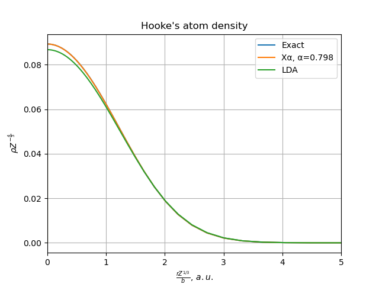
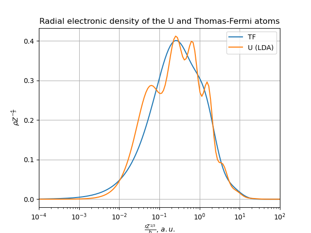

# AtomEnergyLevels

[](https://travis-ci.com/malykhin-sergei/AtomEnergyLevels.jl)
[](https://coveralls.io/github/malykhin-sergei/AtomEnergyLevels.jl?branch=master)
[](https://codecov.io/gh/malykhin-sergei/AtomEnergyLevels.jl)
[](https://malykhin-sergei.github.io/AtomEnergyLevels.jl/dev/)

Solve numerically

 1. 1D [Schrödinger equation](https://en.wikipedia.org/wiki/Schr%C3%B6dinger_equation) by the [spectral collocation (i.e., pseudospectral) method](https://en.wikipedia.org/wiki/Collocation_method)
 2. Schrödinger equation for the [particle in a spherically symmetric potential](https://en.wikipedia.org/wiki/Particle_in_a_spherically_symmetric_potential)
 3. [Kohn-Sham equation](https://en.wikipedia.org/wiki/Kohn%E2%80%93Sham_equations) for an atom using [local-density approximation (LDA)](https://en.wikipedia.org/wiki/Local-density_approximation)

## Usage

### Morse potential

Using the following code, one can find the vibrational levels of the radical OH⋅,
for which the potential energy surface is approximated through the [Morse potential](https://en.wikipedia.org/wiki/Morse_potential).

```julia
using AtomEnergyLevels
using LinearAlgebra, Test, Printf

# Morse potential
V(x, D, β, x₀) = D*(exp(-β*(x-x₀))-1)^2 - D;

# parameters of the O-H bond
D  = 0.1994;   β = 1.189;  x₀ = 1.821;
mH = 1.00794; mO = 15.9994; μ = 1822.8885*(mH*mO)/(mH+mO);  

# grid
x = (2.0 - x₀):0.1:(12.0 + x₀);

# hamiltonian
H = -1/2μ*laplacian(x) + Diagonal(V.(x, D, β, x₀));

# numerical solution
ϵ, ψ = eigen(H);                      

# exact solution
ω = β*sqrt(2D/μ); δ = ω^2 / 4D;  
E(n) = ω*(n+1/2) - δ*(n+1/2)^2 - D;

# comparison
@testset "energies of the Morse potential" begin
  for i in 1:5
    @printf "Level %i: E(exact) = %5.10f E(approx) = %5.10f\n" i E(i-1) ϵ[i]
    @test ϵ[i] ≈ E(i-1) atol = 1e-9
  end
end
```
Output
```
Level 1: E(exact) = -0.1904720166 E(approx) = -0.1904720166
Level 2: E(exact) = -0.1732294768 E(approx) = -0.1732294768
Level 3: E(exact) = -0.1568048397 E(approx) = -0.1568048397
Level 4: E(exact) = -0.1411981052 E(approx) = -0.1411981048
Level 5: E(exact) = -0.1264092734 E(approx) = -0.1264092731
Test Summary:                   | Pass  Total
energies of the Morse potential |    5      5
Test.DefaultTestSet("energies of the Morse potential", Any[], 5, false)
```
### 3D isotropic harmonic oscillator problem

Using the following code, one can find the energy levels for a
[spherically-symmetric three-dimensional harmonic oscillator.](https://en.wikipedia.org/wiki/Quantum_harmonic_oscillator#Example:_3D_isotropic_harmonic_oscillator)

To find the energy levels with quantum numbers nᵣ = 0, 1, 2 and l = 0, 1, 2,
the levels of interest should be included in the electronic configuration
```julia
using AtomEnergyLevels, Printf

function isotropic_harmonic_oscillator(cfg)
  ψ = radial_shr_eq(r -> 1/2*r^2, conf = conf_enc(cfg)).orbitals;
  @printf("\tϵ(calc.)\tϵ(exact)\tΔϵ\n");
  for (quantum_numbers, orbital) in sort(collect(ψ), by = x -> last(x).ϵᵢ)
    nᵣ, l = quantum_numbers
    ϵ_calc = orbital.ϵᵢ
    n = nᵣ + l + 1
    ϵ_exact = 2nᵣ + l + 3/2
    @printf("%i%s\t%10.8f\t%10.8f\t%+0.6e\n",
            n, atomic_shell[l], ϵ_calc, ϵ_exact, ϵ_exact - ϵ_calc)
  end
end

isotropic_harmonic_oscillator("1s1 2s1 3s1 2p1 3p1 4p1 3d1 4d1 5d1");
```
The output will be
```
        ϵ(calc.)        ϵ(exact)        Δϵ
1S      1.50000000      1.50000000      -2.639289e-11
2P      2.50000000      2.50000000      +3.940093e-11
3D      3.50000000      3.50000000      +2.014788e-11
2S      3.50000000      3.50000000      -2.537082e-12
3P      4.50000000      4.50000000      +3.407141e-11
4D      5.50000000      5.50000000      +3.625988e-11
3S      5.50000000      5.50000000      +4.071410e-12
4P      6.50000000      6.50000000      +2.108536e-12
5D      7.50000000      7.50000000      +4.278622e-11
```
### Hooke's atom

Find the total energy and density of the [Hooke's atom](https://en.wikipedia.org/wiki/Hooke's_atom) using LDA DFT.

```julia
using AtomEnergyLevels
using SpecialFunctions, PyPlot
pygui(true);

x = -30.0:0.1:20.0;
r  = exp.(x);

# exact density of the ground state, see
# S. Kais et al // Density functionals and dimensional 
# renormalization for an exactly solvable model, JCP 99, 417 (1993); 
# http://dx.doi.org/10.1063/1.465765

N² = 1 / (π^(3/2) * (8 + 5 * sqrt(π)));
ρₑ = @. 2N² * exp(-1/2 * r^2) * (sqrt(π/2) * (7/4 + 1/4 * r^2 + (r + 1/r) * erf(r/sqrt(2))) + exp(-1/2 * r^2));

xalpha = lda(2, x, conf = 2, Vex = r -> 1/8 * r^2, xc! = (ρ, vxc, exc) -> Xα!(ρ, vxc, exc, α = 0.798));
svwn5  = lda(2, x, conf = 2, Vex = r -> 1/8 * r^2);

begin
    title("Hooke's atom density")
    xlabel(L"\frac{r Z^{1/3}}{b},\,a.u.")
    ylabel(L"\rho Z^{-\frac{4}{3}}")
    
    ax1 = PyPlot.axes()
    ax1.set_xlim([0,5])

    plot(r, ρₑ, label = "Exact")
    plot(r, xalpha.density ./ r, label = "Xα, α=0.798")
    plot(r, svwn5.density ./ r, label = "LDA")

    legend(loc = "upper right", fancybox = "true")
    grid("on")
end
```
LDA results output:
```
[ Info: Using logarithmic 501 point grid with step dx = 0.1000
[ Info: Starting SCF procedure with convergence threshold |Δρ| ≤ 1.000000e-07
[ Info: cycle           energy          |Δρ|
[ Info:   0           2.103849      1.895566
[ Info:   1           2.013080      0.357780
[ Info:   2           2.023521      0.039644
[ Info:   3           2.026081      0.003607
[ Info:   4           2.026212      0.000404
[ Info:   5           2.026228      0.000045
[ Info:   6           2.026229      0.000005
[ Info:   7           2.026229      0.000001
[ Info:   8           2.026229      0.000000
┌ Info: RESULTS SUMMARY:
│       ELECTRON KINETIC               0.627459
│       ELECTRON-ELECTRON              1.022579
│       EXCHANGE-CORRELATION          -0.523773
│       ELECTRON-NUCLEAR               0.899965
│       TOTAL ENERGY                   2.026229
└       VIRIAL RATIO                  -2.229260
```
Compare with exact Kohn-Sham values from Table II of S. Kais et al
```
        ELECTRON KINETIC               0.6352
        ELECTRON-ELECTRON              1.0320
        EXCHANGE-CORRELATION          -0.5553
        ELECTRON-NUCLEAR               0.8881
        TOTAL ENERGY                   2.0000
        VIRIAL RATIO                  -2.1486
```


### Uranium atom

Compare with NIST [Atomic Reference Data for Electronic Structure
Calculations, Uranium](https://www.nist.gov/pml/atomic-reference-data-electronic-structure-calculations/atomic-reference-data-electronic-7-90)

```julia
using AtomEnergyLevels
using PyPlot
pygui(true)

b = 1/2 * (3π/4)^(2/3)

x = -30.0:0.1:20.0; r  = exp.(x);

Z = 92; ρ = lda(Z, x).density;

begin
    title("Radial electronic density of the U and Thomas-Fermi atoms")
    xlabel(L"\frac{r Z^{1/3}}{b},\,a.u.")
    ylabel(L"\rho Z^{-\frac{4}{3}}")

    grid("on")

    ax1 = PyPlot.axes()
    ax1.set_xlim([0.0001,100])
    PyPlot.xscale("log")
    
    plot(r/b, 4π * r .^ 2 .* TF.(r, 1), label = "TF")
    plot(r/b * Z^(1/3), 4π * r .* ρ / Z^(4/3), label = "U (LDA)")
    legend(loc = "upper right", fancybox = "true")
end
```
Output:
```
[ Info: Using logarithmic 501 point grid with step dx = 0.1000
[ Info: Starting SCF procedure with convergence threshold |Δρ| ≤ 1.000000e-07
[ Info: cycle           energy          |Δρ|
[ Info:   0      -25892.940688     13.946827
[ Info:   1      -25392.907465      9.142395
[ Info:   2      -25839.860895      7.440384
[ Info:   3      -25734.593283      3.920120
[ Info:   4      -25654.245863      1.816286
[ Info:   5      -25662.380950      0.745344
[ Info:   6      -25661.726995      0.682063
[ Info:   7      -25657.713231      0.260715
[ Info:   8      -25659.149922      0.072949
[ Info:   9      -25658.990090      0.064592
[ Info:  10      -25658.353079      0.033047
[ Info:  11      -25658.437031      0.016313
[ Info:  12      -25658.433437      0.014779
[ Info:  13      -25658.411140      0.003996
[ Info:  14      -25658.423601      0.000965
[ Info:  15      -25658.422312      0.000868
[ Info:  16      -25658.417277      0.000458
[ Info:  17      -25658.417935      0.000233
[ Info:  18      -25658.417919      0.000211
[ Info:  19      -25658.417827      0.000056
[ Info:  20      -25658.417919      0.000013
[ Info:  21      -25658.417912      0.000012
[ Info:  22      -25658.417883      0.000007
[ Info:  23      -25658.417887      0.000003
[ Info:  24      -25658.417887      0.000003
[ Info:  25      -25658.417888      0.000001
[ Info:  26      -25658.417889      0.000000
[ Info:  27      -25658.417889      0.000000
[ Info:  28      -25658.417888      0.000000
[ Info:  29      -25658.417889      0.000000
┌ Info: RESULTS SUMMARY:
│       ELECTRON KINETIC           25651.231179
│       ELECTRON-ELECTRON           9991.594177
│       EXCHANGE-CORRELATION        -425.032628
│       ELECTRON-NUCLEAR          -60876.210617
│       TOTAL ENERGY              -25658.417889
└       VIRIAL RATIO                   2.000280
```


## Author

Sergei Malykhin, s.e.malykhin@gmail.com

## License

This project is licensed under the MIT License - see the LICENSE file for
details.